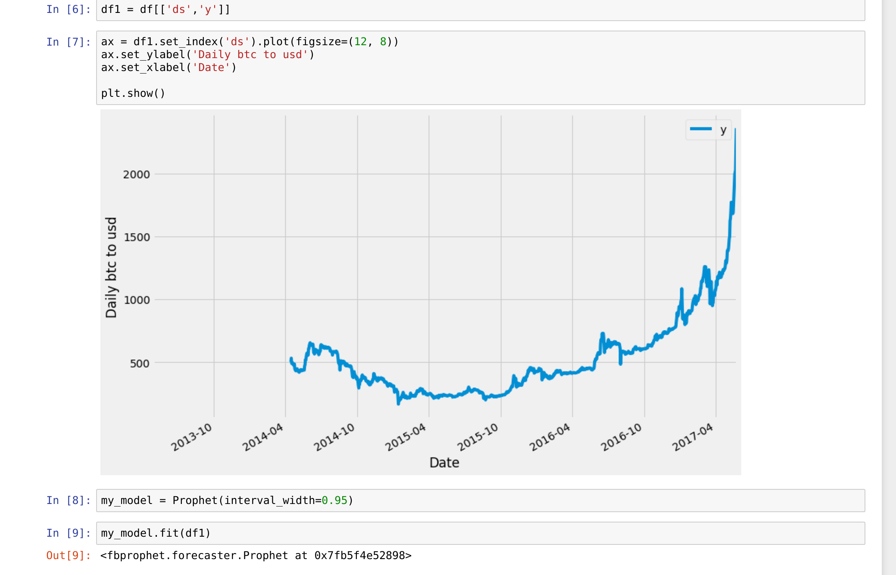
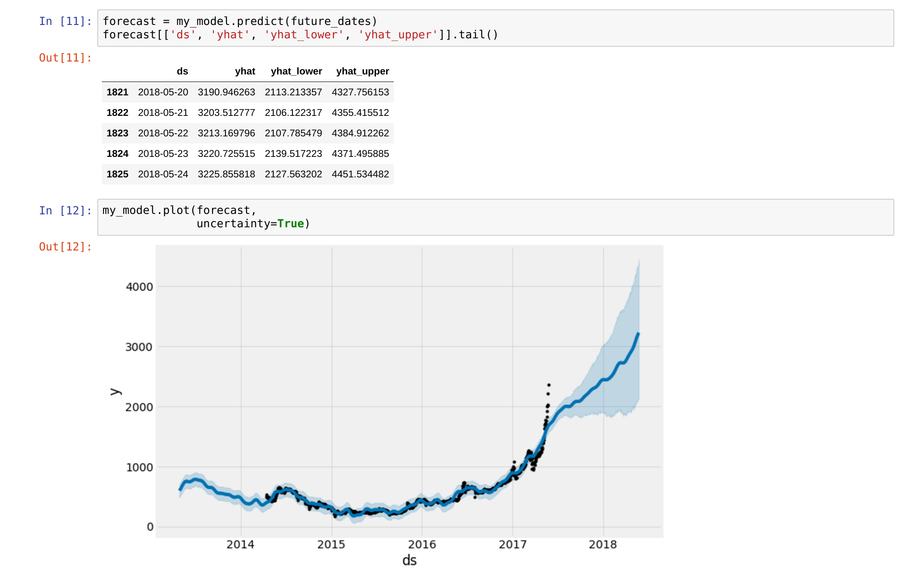
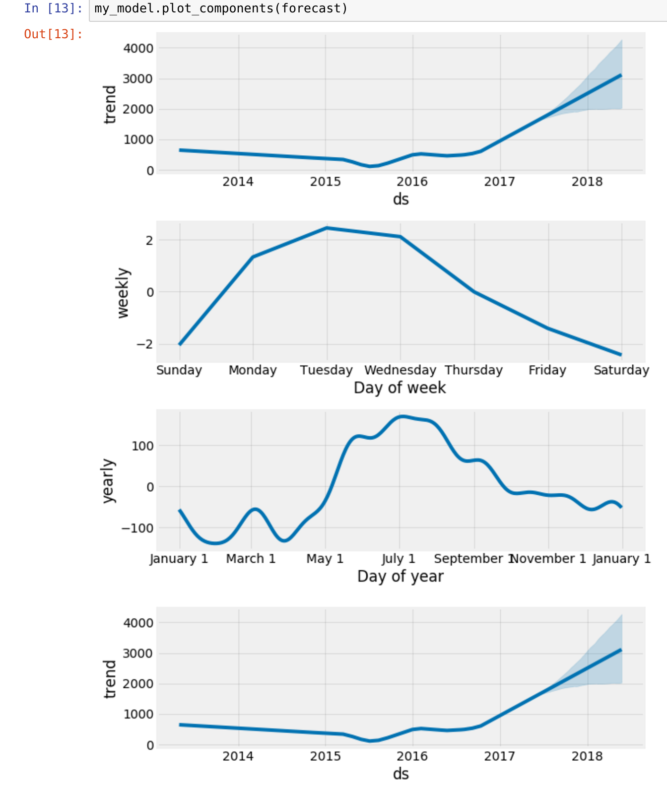
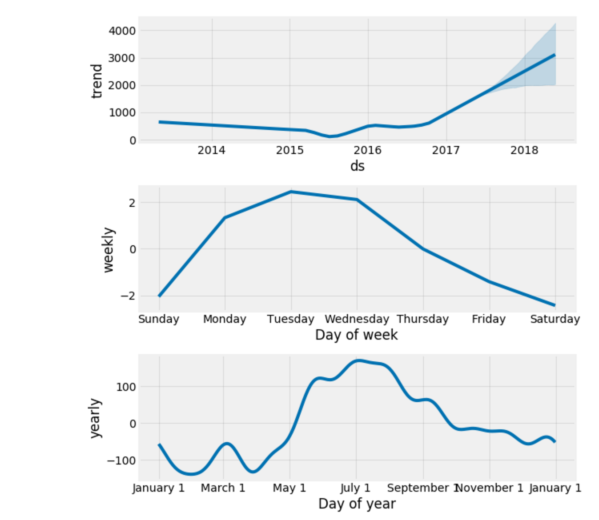
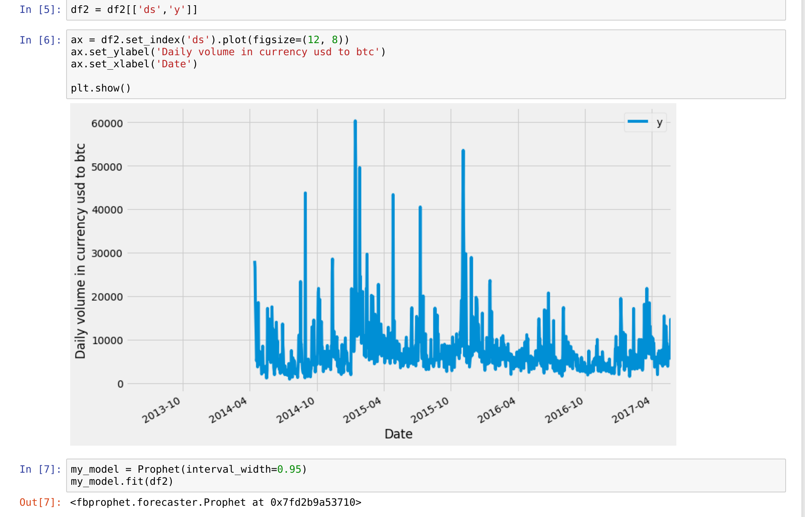
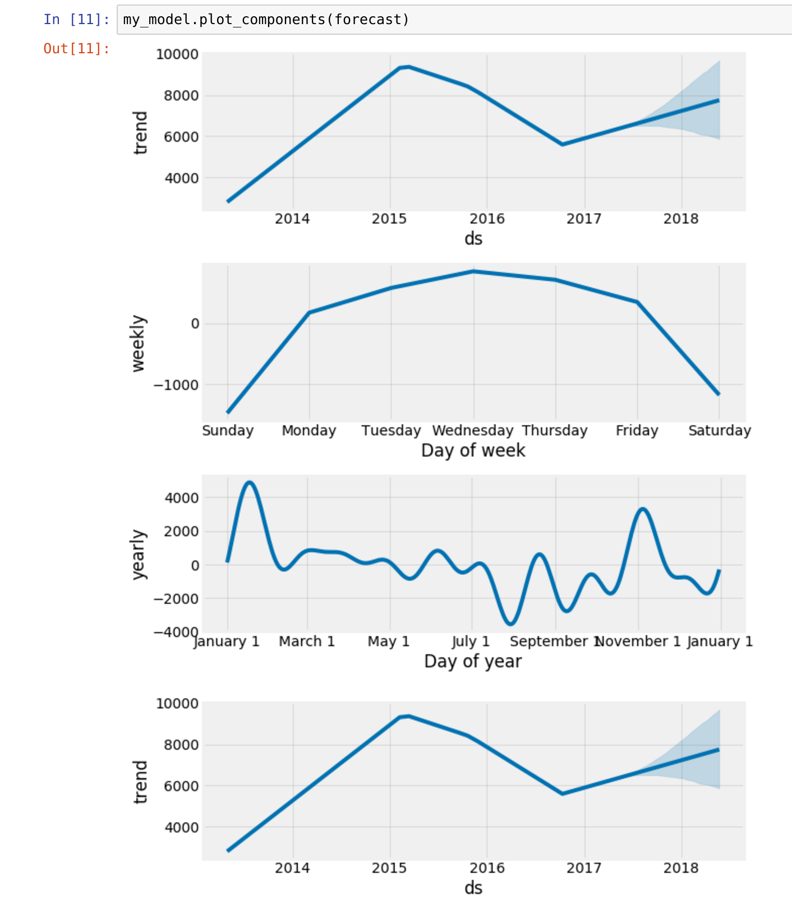
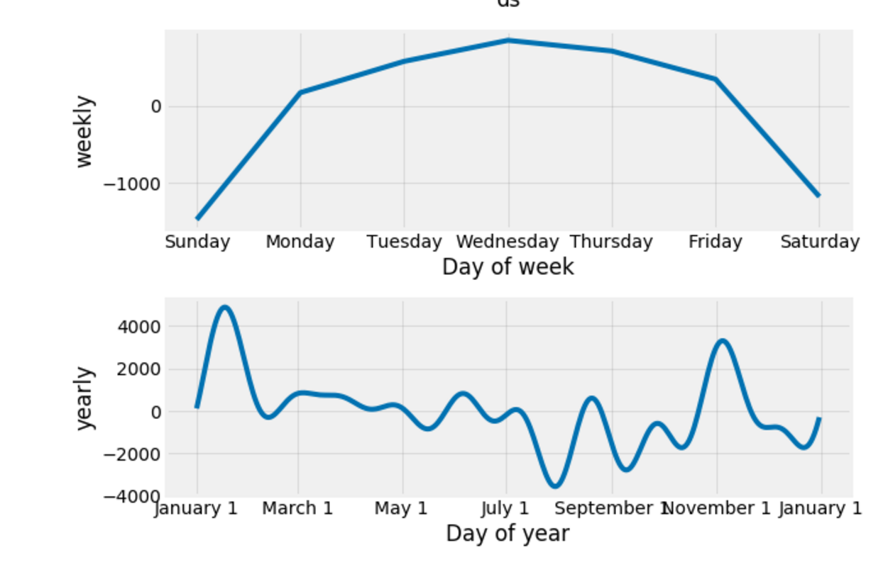
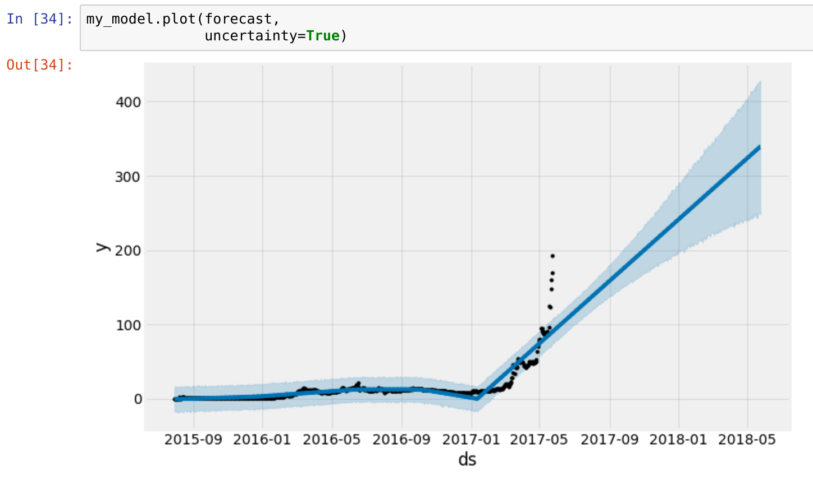
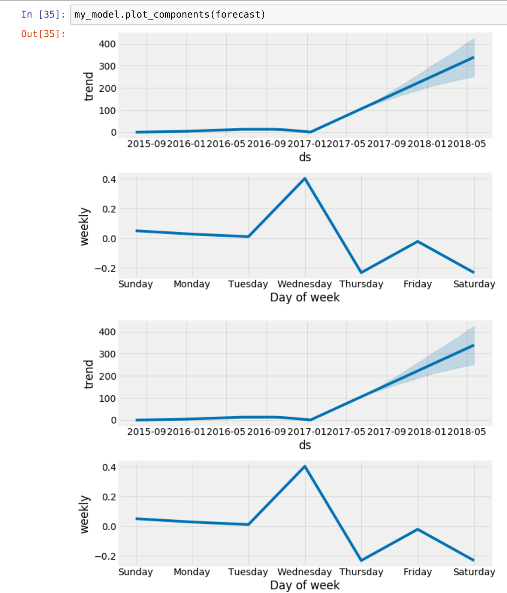

# Jupyter bitcoin forecasting
## Before running scripts I've installed:
* fbprophet

## Main forecasting made by facebook prophet

### Daily graph

### Daily forecast for +365 days

### Daily forecasting components

### Volume in currency graph

### Volume in currency forecast for +365 days

### Volume in currency forecasting components

# Etherium

### Etherium forecast for +365 days

### Etherium forecasting components

